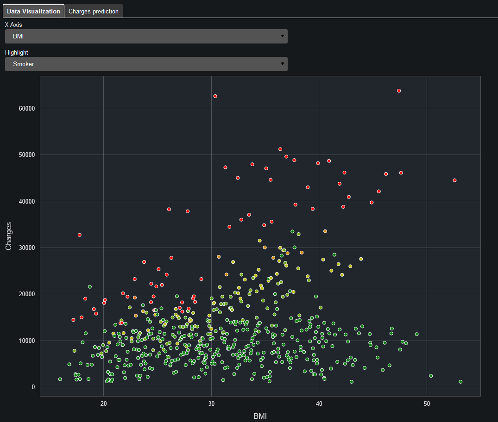
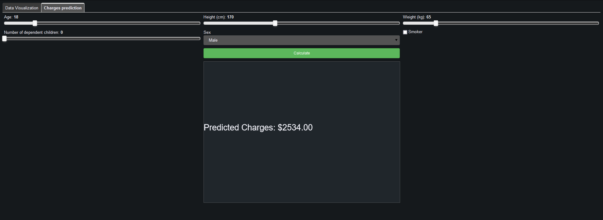

# Medical Cost Visualization

Medical cost visualization and prediction using [Dask](https://www.dask.org/) for data manipulation and [Bokeh](https://docs.bokeh.org/en/latest/) for visualization 

</img>
</img>

## Setting Up

Install the requirements using pip

    pip install -r requirements.txt

## Running

To view the app directly from a Bokeh server, navigate to the parent directory and execute the command:

    bokeh serve medical-cost-visualization --show

The app will start and open the browser in it's page

## All rights reserved to João Vitor Oliveira de Melo ([JhonesBR][myGit] on github)

[myGit]: <https://github.com/JhonesBR>